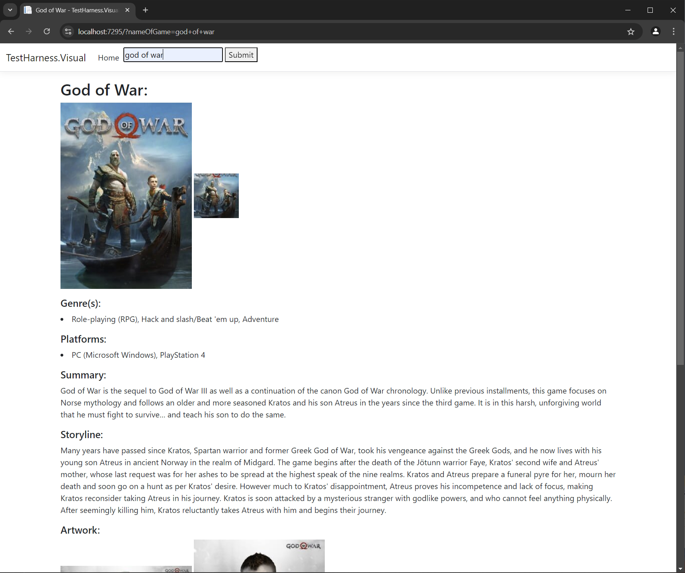
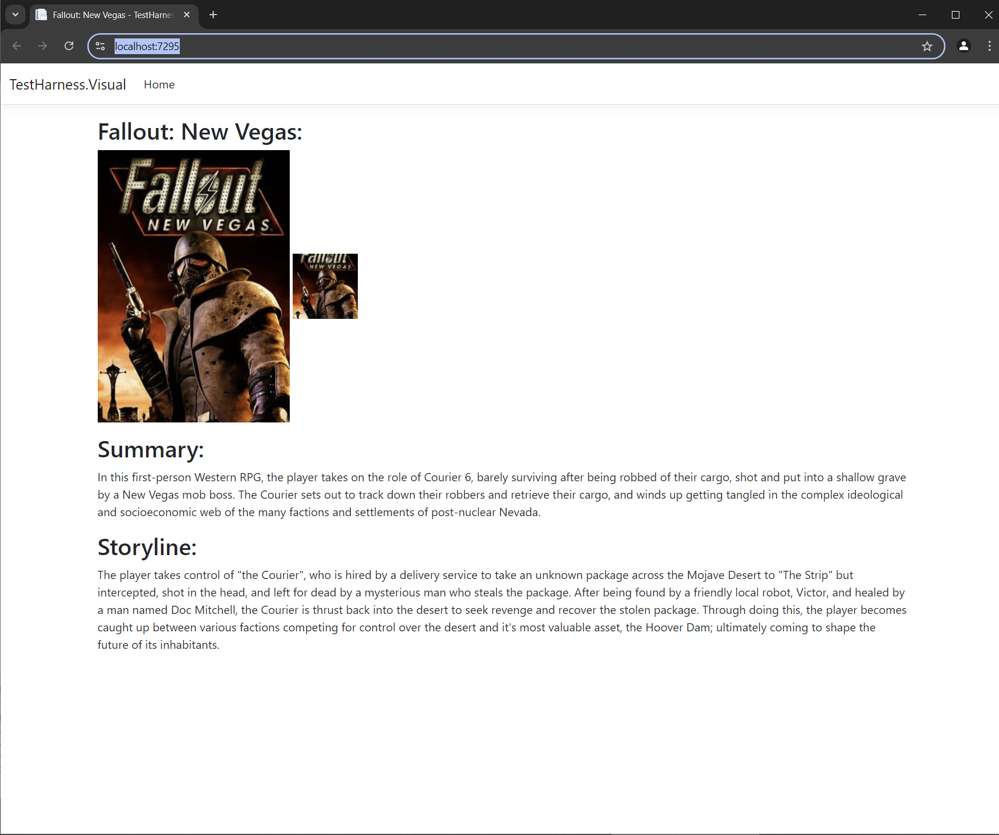
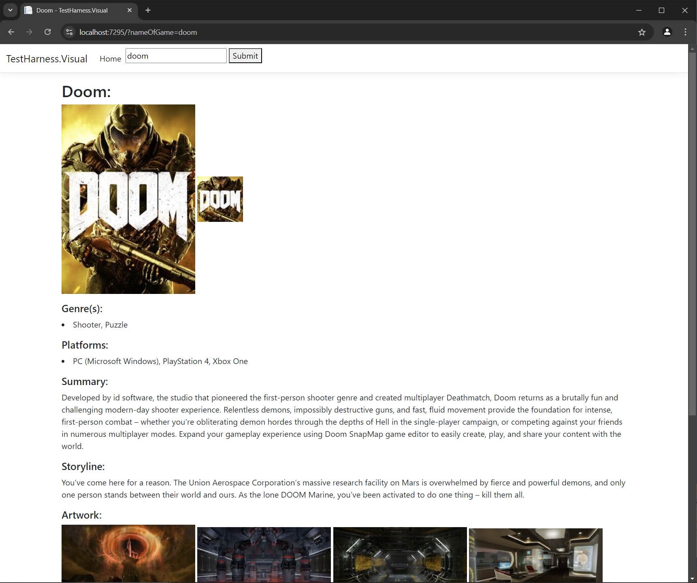

-----------------------------------------
IGDB (Internet Game Database) Rest API
-----------------------------------------

First created on: 08/08/2024

I wanted to add video game cover artwork to another project of mine and didn’t think hosting hundreds of cover art images in my own application was a sensible approach so looked out for available API’s that could achieve the same goal.  I found that the IGDB database had an available free to use rest API so i have begun creating a C# wrapper for this with both a console and a ASP.NET MVC Core website test harness to allow me to call and test the API easily.

This project is still in development and will have further optimization as time goes on.

Technologies / Principles Used:

- C#
- ASP.NET MVC Core
- REST
- IGDB API
- NET Core (Console & Class Library)
- RestSharp
- Newtonsoft.Json

Resources / Credits:

- https://www.igdb.com/
- https://api-docs.igdb.com/#authentication

Images:

Visual examples of some of the returned data from the rest based IGDB Api.

