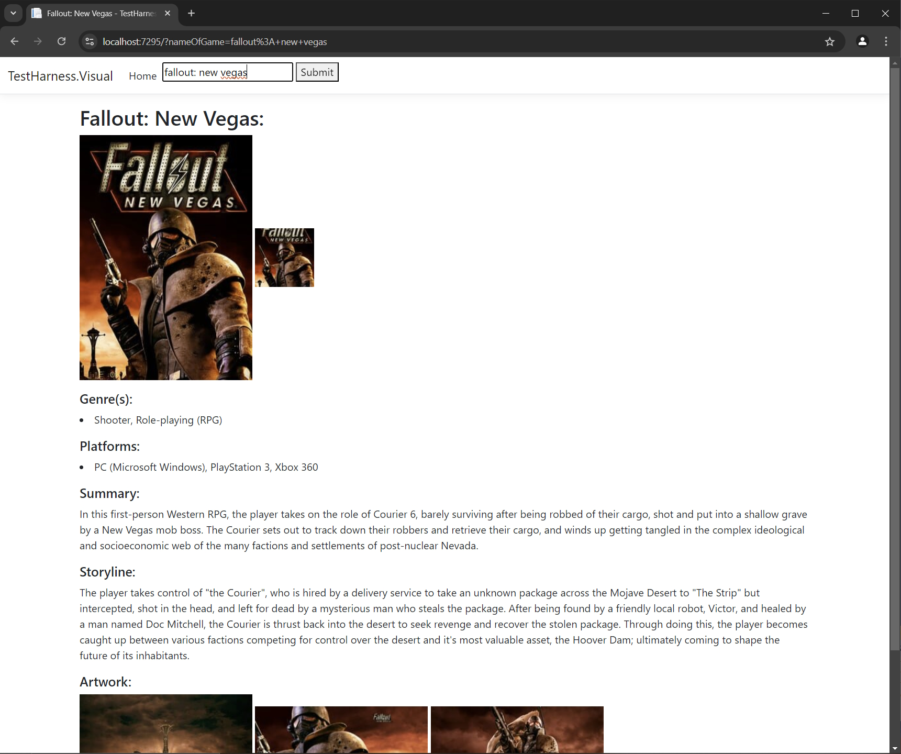

-----------------------------------------
IGDB (Internet Game Database) Rest API
-----------------------------------------

First created on: 08/08/2024

I wanted to add video game cover artwork and data to another project of mine and didn’t think hosting hundreds of cover art images in my own application or database was a sensible approach so I was looking out for a API that could achieve this goal.  I found that IGDB (www.igdb.com) had a free to use REST API that provides the type of information i need so i have begun creating a C# wrapper (Class library project) for this with both a console and a ASP.NET MVC Core website test harness to allow me to call and test the API easily.  The C# wrapper (Class library) can then be integrated into any host application giving it easy access to this functionality.

NOTE!:

This project is still in active development and will have further optimizations made as time goes on.  My main focus is to implement the main core functions of the API and then as it progresses add in quality of life and efficiency improvements.

Technologies / Principles Used:

- C#
- ASP.NET MVC Core
- Console
- Class Library
- REST API
- IGDB API
- NET Core (Console & Class Library)
- RestSharp
- Newtonsoft.Json

Resources / Credits:

- https://www.igdb.com/
- https://api-docs.igdb.com/#authentication

Images:

Visual examples of some of the returned data from the rest based IGDB Api.

